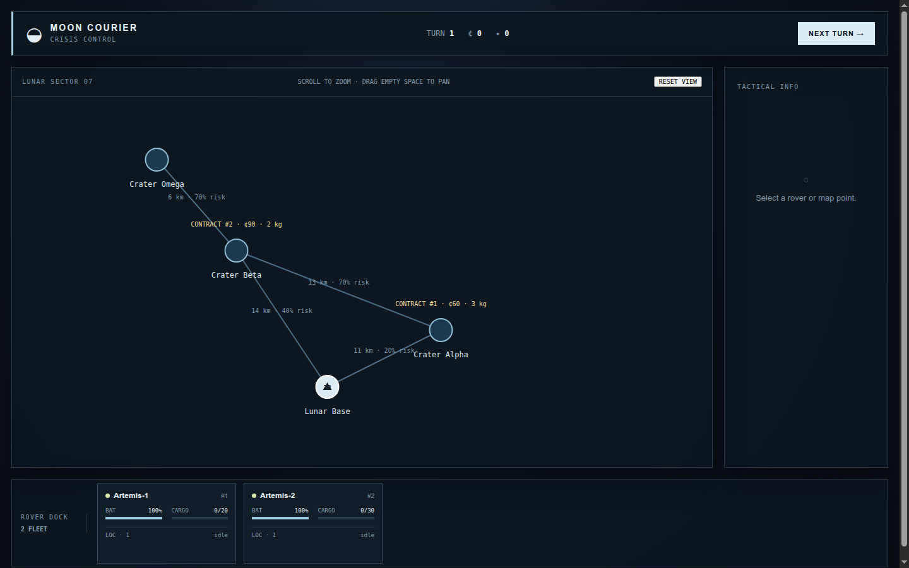
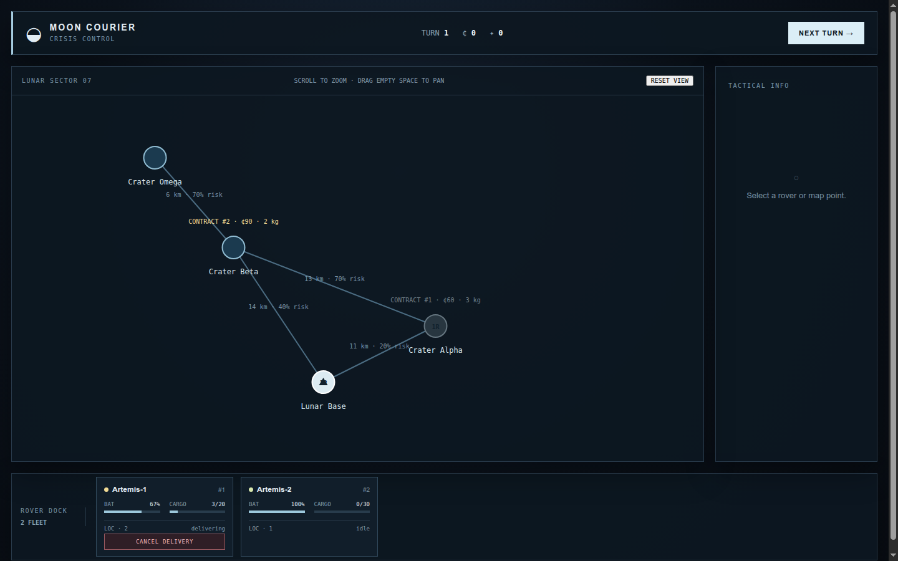

# Moon Courier Crisis Game

[](https://github.com/DanilFaritovich/Moon-courier-crisis-game/actions/workflows/ci.yml)
[](LICENSE)

**Moon Courier Crisis** is a full-stack turn-based logistics game where the player manages lunar rovers, delivery contracts, battery capacity, cargo constraints, and mission progression from a mission-control interface.

The project was built as a portfolio application to demonstrate production-oriented Python backend development together with a typed Vue frontend, automated testing, Docker-based deployment, and CI quality gates.

## Interface

| Mission overview | Active delivery |
| --- | --- |
|  |  |

## What this project demonstrates

### Backend engineering

- FastAPI REST API with typed Pydantic request and response models.
- Domain-oriented service layer for game, rover, order, delivery, event, and graph logic.
- SQLAlchemy repositories and a Unit of Work abstraction.
- Backend-authoritative business rules: route feasibility, cargo limits, battery prediction, delivery lifecycle, and turn processing are calculated server-side.
- Explicit separation between API, domain services, persistence, and transport models.
- Structured logging and health-check endpoints.

### Frontend engineering

- Vue 3 + TypeScript using the Composition API.
- Interactive SVG lunar map with pan and zoom.
- Drag-and-drop rover assignment.
- Contract selection and delivery confirmation flows.
- Typed API client and frontend state synchronized with backend responses.
- Component and workflow tests with Vitest and Vue Test Utils.
- Browser-level end-to-end coverage with Playwright.

### Delivery and quality

- Docker Compose environment for running the complete application.
- Nginx serves the frontend and proxies API requests to FastAPI.
- GitHub Actions CI for backend, frontend, Docker smoke tests, and Playwright E2E tests.
- Ruff, Mypy, Pytest, ESLint, Prettier, `vue-tsc`, Vitest, and production build checks.

## Tech stack

| Area | Technologies |
| --- | --- |
| Backend | Python 3.14, FastAPI, Pydantic, SQLAlchemy |
| Backend quality | Pytest, Ruff, Mypy |
| Frontend | Vue 3, TypeScript, Composition API, Vite |
| Frontend quality | Vitest, Vue Test Utils, ESLint, Prettier, `vue-tsc`, Playwright |
| Infrastructure | Docker, Docker Compose, Nginx |
| CI | GitHub Actions |
| Persistence | SQLite for the current demo build |

## Architecture

```text
Vue 3 / TypeScript UI
        │
        │ HTTP
        ▼
FastAPI routers
        │
        ▼
GameService
        │
        ├── RoverService
        ├── OrderService
        ├── DeliveryService
        ├── EventService
        └── GraphService
                │
                ▼
      SQLAlchemy repositories
                │
                ▼
              SQLite
```

The frontend is intentionally thin: it renders state and sends commands, while game rules and state transitions remain on the backend. This keeps the business logic in one place and makes it independently testable.

## Key engineering decisions

- **Backend as the source of truth.** The client never calculates delivery outcomes itself. It requests feasible contracts and projected battery state from the API before confirming an action.
- **Service-oriented domain logic.** Game orchestration is separated from rover, order, delivery, event, and graph responsibilities instead of placing all logic inside API handlers.
- **Repository abstraction.** Persistence concerns are isolated behind repository interfaces and a Unit of Work layer.
- **Seeded playable state.** The application starts with a ready-to-use lunar map, rovers, and delivery contracts so it can be demonstrated immediately.
- **Automated regression coverage.** Unit/component tests are complemented by Playwright E2E tests that exercise the application through the browser.
- **Reproducible local deployment.** The full stack can be started with one Docker Compose command.

## Run the application

### Docker — recommended

Requirements:

- Docker Engine or Docker Desktop
- Docker Compose

```bash
git clone https://github.com/DanilFaritovich/Moon-courier-crisis-game.git
cd Moon-courier-crisis-game
docker compose up --build
```

Open:

```text
http://127.0.0.1:8080
```

Nginx serves the Vue application and proxies API requests to the FastAPI container.

## Run for development

### Backend

Requirements: Python 3.14.

```bash
python -m venv .venv
source .venv/bin/activate
pip install -r backend/requirements.txt

cd backend
uvicorn app.main:app --reload
```

Backend:

```text
http://127.0.0.1:8000
```

FastAPI docs:

```text
http://127.0.0.1:8000/docs
```

### Frontend

Requirements: Node.js 22 and npm.

```bash
cd frontend
npm ci
npm run dev
```

Vite normally starts at:

```text
http://127.0.0.1:5173
```

During development, Vite proxies `/game` and `/health` requests to FastAPI.

## Gameplay flow

1. Select or drag an idle rover to a lunar destination.
2. Request the delivery contracts available to that rover.
3. Choose a feasible contract.
4. Review cargo, reward, and projected battery usage.
5. Confirm the delivery.
6. Advance the turn to process active missions and generate the next state.
7. Cancel an active delivery when necessary and return the rover to its base state.

## API overview

| Method | Endpoint | Purpose |
| --- | --- | --- |
| `GET` | `/health` | Service health check |
| `GET` | `/game/state` | Current game state |
| `GET` | `/game/map` | Lunar map points and roads |
| `GET` | `/game/rovers/{rover_id}/available-orders` | Feasible contracts and battery projection |
| `POST` | `/game/deliveries` | Assign a rover to an order |
| `DELETE` | `/game/deliveries/{delivery_id}` | Cancel an active delivery |
| `POST` | `/game/next-turn` | Advance the simulation |

`POST /game/initialize` is retained for API compatibility. The current UI does not need to call it because the backend seeds a playable state during startup.

## Quality checks

### Backend

Run from the repository root with the Python environment activated:

```bash
python -m ruff check .
python -m ruff format --check .
python -m mypy .
python -m pytest
```

### Frontend

```bash
cd frontend
npm run format:check
npm run lint
npm run typecheck
npm run test
npm run build
npm run test:e2e
```

CI also builds the Docker images, starts the full application, checks the backend health endpoint, performs a proxied API smoke test, and runs Playwright against the containerized stack.

## Project structure

```text
.
├── backend/             # FastAPI app, domain services, repositories, models, tests
├── frontend/            # Vue 3 app, component tests, Playwright E2E tests
├── data/map.json        # Lunar map source data
├── docs/images/         # README screenshots
├── .github/workflows/   # CI pipeline
├── docker-compose.yml   # Full-stack local environment
└── pyproject.toml       # Python tooling configuration
```

## Current limitations

- SQLite is used for the current demo build.
- Game state is scoped to one backend process and resets when the backend restarts.
- Authentication and multi-user save slots are intentionally outside the scope of the first release.

## Possible next steps

- PostgreSQL persistence and saved games.
- Player accounts and multiple save slots.
- More random events and route risk mechanics.
- Rover upgrades and richer economy mechanics.
- Deployment to a public demo environment.

## License

Released under the [MIT License](LICENSE).
